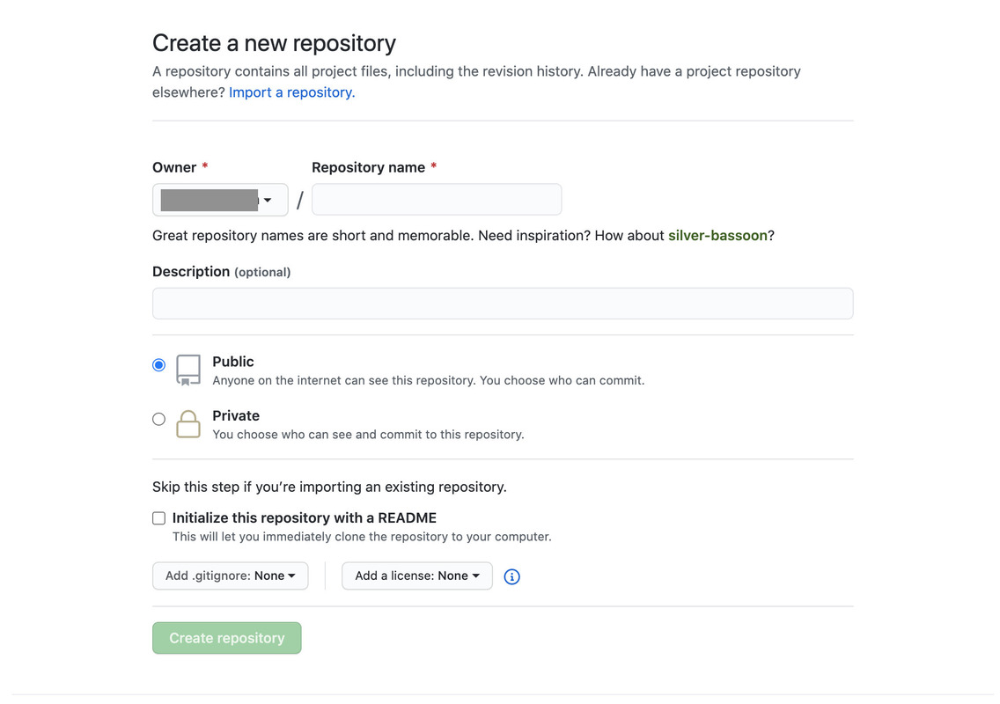
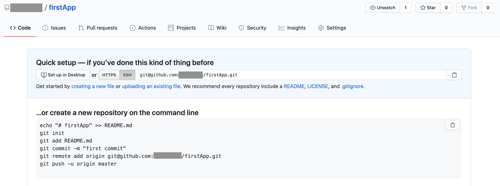

# 第3章 - ファイル管理 - 第1部 - GitとGitHub

## はじめに

第3章では、これから作成していくファイルの管理方法を学習していきます。

## WEBアプリケーションはみんなで開発が主流

WEBアプリケーションを含む、何かしらのシステムを作る際は複数人でチームを組んで開発します。
プログラムは文章なので、システム開発は例えるならば1冊の小説を複数人で書くようなものなのですが、その際にどのファイルを誰がいつ更新したかなどを管理するのは非常に大変です。
今回学習するのは、その管理を非常に簡潔に行ってくれるGitHubというサービスです。

## Git

プログラムの変更履歴などを管理してくれるシステムをGitといいます。

## Github

Githubとは、Gitシステムを基盤とした複数人でのプログラムのバージョン管理に用いられるサービスです。

## 開発体制

開発の際、みんなそれぞれが自分のパソコンにローカル環境を保持し、何か変更をおこなったらGitHubにその変更を保存しにいきます。
保存が完了すると他のユーザーはその変更が反映されたデータを自分のローカル環境に取り込みます。この流れを繰り返しながらプログラムは作られていきます。

## GitHubの仕組み

GitHubは簡単にいうと、私たちが作成しているプログラムを保存する場所を持っているサービスです。
GitHubの保存庫に保存する際は保存した人の名前や日付、保存した人が変更した箇所などを記憶してくれるので、後々何かプログラムエラーが起こった際に巻き戻しをすることや、間違ったプログラムを事前にチェックしたりすることができます。
また、チーム開発をする際は変更した箇所が被らないように誘導してくれるので、非常に重宝されます。

## GitHubの登録

GitHubはgitのリポジトリをクラウドで管理するためのサービスです。
クラウド上で管理するため、複数人でソースコードを管理／共有しやすくなります。

### 1.以下のリンクよりGitHubの登録を行いましょう。
---

https://github.com/

## リポジトリの作成

リポジトリとは、GitHubではデータ保存庫のことを指します。
GitHub上のリポジトリのことをリモートリポジトリと言い、自分のパソコン上にあるリポジトリをローカルリポジトリと呼びます。
今回は、そのリモートリポジトリを作成するところまでの準備を行います。

### 1.マイページに行く
---

Githubにログインすると右側に自分のアイコンが表示されます。
まずはそれをクリックしましょう。

### 2.マイリポジトリに行く
---

アイコンの右側にOverviewというメニューがあると思いますが、
その隣にあるRepositoriesというメニューをクリックします。

### 3.リポジトリを作る
---

先ほどのメニューバーの1行下の列の1番右にNEWという緑のボタンがあります。
それをクリックすると、以下のようなリポジトリ作成画面が出てくるので手順に従って記入してください。

#### Repository name

リポジトリの名前を決めます。
今回はfirstAppにしましょう。

#### Description

このリポジトリの説明を書く場所です。任意なので書かなくても大丈夫です。

#### Public or Private

鍵付きのリポジトリにするかどうかを聞かれています。
今回は公開にしましょう。

#### Initialize this repository with a README

README（リードミー）と言われる、リポジトリの使い方などを記入するものがあります。
こちらは今回はチェックを入れません。

### 4.Create repositoryをクリックして以下の画面が出てきたら完了
---

以下の画面の英語たちは、「ローカルリポジトリ作ろうぜ！」ということを言っています。
ただ、現在のままではまだローカルリポジトリを作れないので一旦は無視しましょう。

